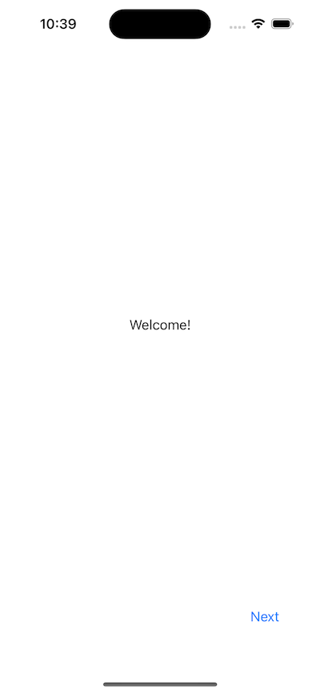

<h1 align="center">
    Generic Onboarding written in SwiftUI
</h1>

### Enum-based onboarding

```swift
enum OnboardingPage: CaseIterable {
    case welcome
    case newFeature
    case otherStuff
    // ... and so on
}
```




---
Please note: when we tap the 'Got it!' button we set the 'isUserOnboarded' property to 'true' and onboarding screen won't be shown next time.